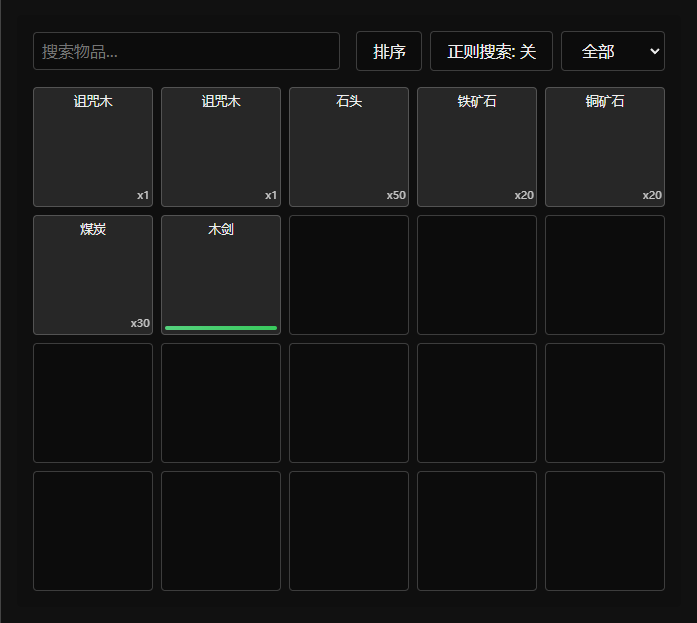

# Slot Inventory
传统的物品仓库，以格子为基础，可设置每个容器的槽位数量与最大堆叠数。支持排序、正则搜索、分类搜索等功能，并与配方宏配合可达成合成的效果。

> [!TIP]
> 基于 ChapelR 的 [Simple Inventory](https://github.com/ChapelR/simple-inventory/) 修改
> 
> 当前版本: Inventory v0.1.12, Recipes v0.2.1
>
> 打包文件在 [dist/assets](../dist/assets)，使用指南在 [docs/guide.md](./guide.md)




```
assets/js/             # 源码
├── inventory/         # 物品栏系统相关代码
│   ├── 000-popup.js    # 弹窗界面控制
│   ├── 001-type.js     # 物品类型定义
│   ├── 002-item.js     # 物品基础类
│   ├── 003-inv.js      # 物品栏核心逻辑
│   ├── 004-display.js  # 物品栏显示控制
│   └── 005-macro.js    # 物品栏宏命令处理
└── recipes/           # 合成配方系统
    ├── book.js         # 配方书功能
    ├── macro.js        # 合成相关宏命令
    └── recipe.js       # 合成配方定义
```

## 目录

- [使用指南](./guide.md)
- [下载](../dist/assets/)
- API 文档
  - [Popup API](./popup-api.md)
  - [Item API](./item-api.md)
  - [Inventory API](./inv-api.md)