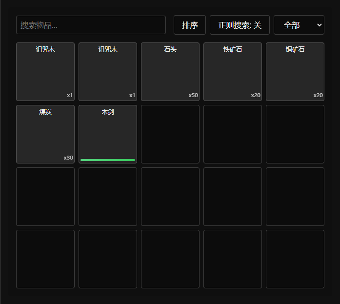

# Slot Inventory
传统的物品仓库，以格子为基础，可设置每个容器的槽位数量与最大堆叠数。支持排序、正则搜索、分类搜索等功能，并与配方宏配合可达成合成的效果。

> [!TIP]
> 基于 ChapelR 的 [Simple Inventory](https://github.com/ChapelR/simple-inventory/) 修改
> 
> 打包文件在 [dist](dist) 中下载

